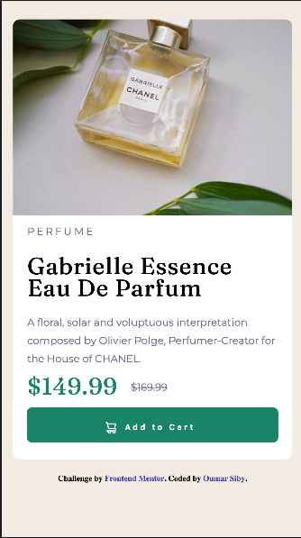

# Frontend Mentor - Product preview card component solution

This is a solution to the [Product preview card component challenge on Frontend Mentor](https://www.frontendmentor.io/challenges/product-preview-card-component-GO7UmttRfa). Frontend Mentor challenges help you improve your coding skills by building realistic projects. 

## Table of contents

- [Overview](#overview)
  - [The challenge](#the-challenge)
  - [Screenshot](#screenshot)
  - [Links](#links)
- [My process](#my-process)
  - [Built with](#built-with)
  - [What I learned](#what-i-learned)
  - [Continued development](#continued-development)
  - [Useful resources](#useful-resources)
- [Author](#author)

**Note: Delete this note and update the table of contents based on what sections you keep.**

## Overview

### The challenge

Users should be able to:

- View the optimal layout depending on their device's screen size
- See hover and focus states for interactive elements

### Screenshot





### Links

- Solution URL: [Solution Code](https://github.com/oumar-s/Product-Preview-Card-Component)
- Live Site URL: [Live Site](https://oumar-s.github.io/Product-Preview-Card-Component/)

## My process

### Built with

- HTML5
- CSS
- Flexbox
- Mobile-first workflow

### What I learned

I learned responsive web design. Specifically, I learned:
- How to make images responsive using html
- How to use media queries
- how to use flexbox and grid for layout
- How to utilize min-width and max-width

see some example code below:
```html
<picture>
  <source media="(min-width: 415px)" srcset="images/image-product-desktop.jpg">
   
</picture>
```
```css
.mainCard {
    display: grid;
    grid-template-rows: 1fr;
    margin-bottom: 20px;
    border-bottom-left-radius: 10px;
    border-bottom-right-radius: 10px;
    border-top-left-radius: 10px;
    border-top-right-radius: 10px;
    min-width: 290px;
}
```

### Continued development
Moving forward, I will continue to improve my HTML and CSS skills. Additionally, I plan on improving my js skill by doing js related projects.

### Useful resources
- [Codecademy Intermediate CSS](https://www.codecademy.com/learn/learn-intermediate-css) - This course is great for learning responsive design or intermediate CSS in general.


## Author
- Website - [Oumar Siby](https://oumar-s.github.io/)
- Frontend Mentor - [@oumar-s](https://www.frontendmentor.io/profile/oumar-s)

